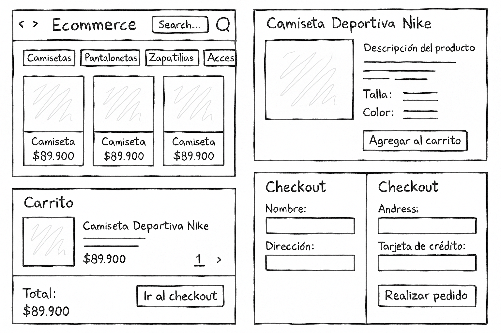
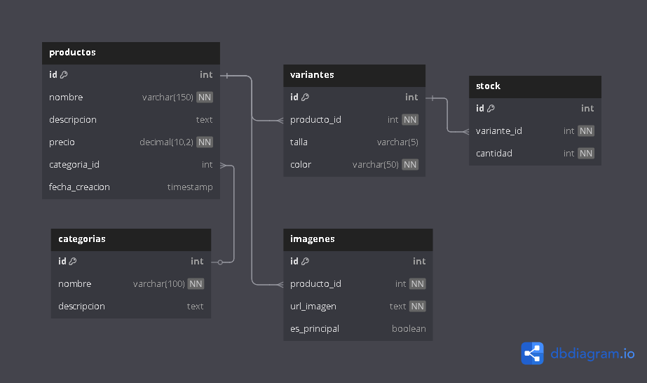

# 🏋️‍♀️🧢 Ecommerce de Ropa Deportiva


> Proyecto desarrollado como parte del reto **#HagaseUnEcommerceChallenge**, una tienda virtual de ropa deportiva moderna, intuitiva y escalable.

---

## 🧩 Tecnologías Usadas

- **Frontend**: React, React Router DOM, Axios  
- **Backend**: Node.js, Express  
- **Herramientas**: Visual Studio Code, Git, GitHub  

---

## 📁 Estructura del Proyecto

```
EcommerceRopaDeportiva/
├── backend/                                # Servidor con Express (Node.js)
│   └── index.js                            # Archivo principal del backend
│   └── ...                                 # Otros archivos y carpetas del backend
├── frontend/                               # Aplicación React
│   ├── src/                                # Código fuente React
│   ├── public/                             # Archivos estáticos
│   └── ...                                 # Otros archivos del frontend
├── resources/                              # Recursos del proyecto
│   ├── Mockup-Ecommerce.png                # Mockup visual de la tienda
│   ├── Diagrama_bd_ecommerce_deporti.png   # Diagrama lógico de la base de datos
│   └── bd_ecommerce_deportivo.dbml         # Modelo de base de datos en formato DBML
├── .gitignore                              # Archivos y carpetas a ignorar por Git
├── README.md                               # Documentación principal del proyecto
```
---
# Descripción general del proyecto
---

## 🚀 ¿Cómo ejecutar el proyecto?

### ▶️ Frontend
```bash
cd frontend
npm install
npm start
Accede a: http://localhost:3000
```

### 🖥️ Backend
```bash
cd backend
npm install
node index.js
Accede a: http://localhost:3001
```
---

## 📦 Recursos del Proyecto

### 🖌️ Mockup de la Tienda
Representa la interfaz visual propuesta para la tienda en línea.

📂 Ubicación: resources/Mockup-Ecommerce.png


### 🧠 Diagrama de Base de Datos
Diseño lógico del modelo de datos del sistema Ecommerce.

📂 Archivos en resources/:
**bd_ecommerce_deportivo.dbml**
**Diagrama_bd_ecommerce_deporti.png**



*El diagrama cubre entidades como categorías, productos, variantes, stock e imágenes, estructuradas para garantizar escalabilidad y rendimiento.*

### 📊 Entidades Principales
Entidad	Descripción
categorias	Clasifica los productos en tipos como ropa, calzado, accesorios, etc.
productos	Contiene información general del producto (nombre, descripción, precio base).
variantes	Define versiones del producto (por ejemplo: color, talla, modelo).
stock	Relaciona cada variante con su cantidad disponible en inventario.
imagenes	Asocia uno o más archivos visuales por producto o variante.
    
Este diseño permite una gestión modular y escalable de los productos, así como una experiencia de usuario enriquecida gracias a la variedad de variantes y representaciones visuales.

---

## 🔗 Repositorio
[GitHub del proyecto](https://github.com/JohnMunioz/EcommerceRopaDeportiva)

